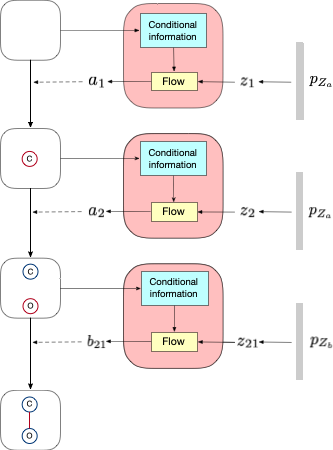

# GraphDF

This is the official implementation for [GraphDF: A Discrete Flow Model for Molecular Graph Generation](https://arxiv.org/abs/2102.01189).



## Table of Contents

1. [Usage](#usage)
1. [Citation](#citation)
1. [Acknowledgement](#acknowledgement)

## Usage

### Random Generation

You can use our trained models or train the model from scratch:
```shell script
$ cd GraphDF
$ CUDA_VISIBLE_DEVICES=${your_gpu_id} python run_rand_gen.py --train --data=qm9 
$ CUDA_VISIBLE_DEVICES=${your_gpu_id} python run_rand_gen.py --train --data=zinc250k
$ CUDA_VISIBLE_DEVICES=${your_gpu_id} python run_rand_gen.py --train --data=moses
```
To generate molecules using our trained model, first download models from [this link](https://github.com/divelab/DIG_storage/tree/main/ggraph/GraphDF/saved_ckpts/rand_gen), then:
```shell script
$ cd GraphDF
$ CUDA_VISIBLE_DEVICES=${your_gpu_id} python run_rand_gen.py --num_mols=100 --model_path=${path_to_the_model} --data=qm9
$ CUDA_VISIBLE_DEVICES=${your_gpu_id} python run_rand_gen.py --num_mols=100 --model_path=${path_to_the_model} --data=zinc250k
$ CUDA_VISIBLE_DEVICES=${your_gpu_id} python run_rand_gen.py --num_mols=100 --model_path=${path_to_the_model} --data=moses
```

### Property Optimization

For property optimization, we aim to generate molecules with desirable properties (*i.e.*, QED and plogp in this work). You can use our trained models or train the model from scratch by reinforcement learning:
```shell script
$ cd GraphDF
$ CUDA_VISIBLE_DEVICES=${your_gpu_id} python run_prop_opt.py --train --prop=plogp
$ CUDA_VISIBLE_DEVICES=${your_gpu_id} python run_prop_opt.py --train --prop=qed
```

To generate molecules using our trained model, first download models from [this link](https://github.com/divelab/DIG_storage/tree/main/ggraph/GraphDF/saved_ckpts/prop_optim), then:
```shell script
$ cd GraphDF
$ CUDA_VISIBLE_DEVICES=${your_gpu_id} python run_prop_opt.py --num_mols=100 --model_path=${path_to_the_model} --prop=plogp
$ CUDA_VISIBLE_DEVICES=${your_gpu_id} python run_prop_opt.py --num_mols=100 --model_path=${path_to_the_model} --prop=qed
```

### Constrained Optimization

For constrained optimization, we aim to optimize molecules with desirable properties (plogp in this work). You can use our trained models or train the model from scratch by reinforcement learning:
```shell script
$ cd GraphDF
$ CUDA_VISIBLE_DEVICES=${your_gpu_id} python run_const_prop_opt.py --train --data=graphaf
$ CUDA_VISIBLE_DEVICES=${your_gpu_id} python run_const_prop_opt.py --train --data=jt
```

To optimize molecules using our trained model, first download models from [this link](https://github.com/divelab/DIG_storage/tree/main/ggraph/GraphDF/saved_ckpts/cons_optim), then:
```shell script
$ cd GraphDF
$ CUDA_VISIBLE_DEVICES=${your_gpu_id} python run_const_prop_opt.py --model_path=${path_to_the_model} --data=graphaf
$ CUDA_VISIBLE_DEVICES=${your_gpu_id} python run_const_prop_opt.py --model_path=${path_to_the_model} --data=jt
```
### Citation
```
@article{luo2021graphdf,
  title={{GraphDF}: A Discrete Flow Model for Molecular Graph Generation},
  author={Luo, Youzhi and Yan, Keqiang and Ji, Shuiwang},
  journal={arXiv preprint arXiv:2102.01189},
  year={2021}
}
```

### Acknowledgement
Our implementation is based on [GraphAF](https://github.com/DeepGraphLearning/GraphAF). Thanks a lot for their awesome works.
